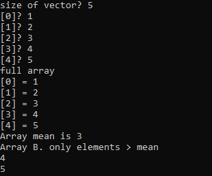
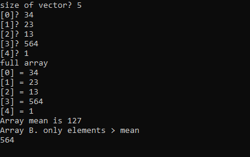
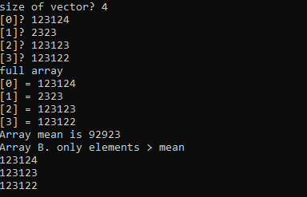
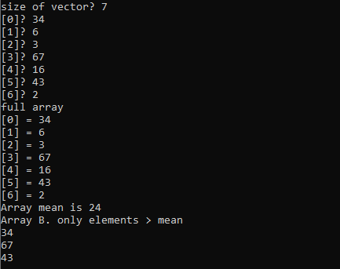
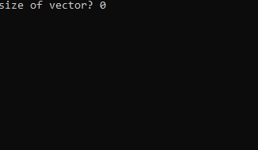
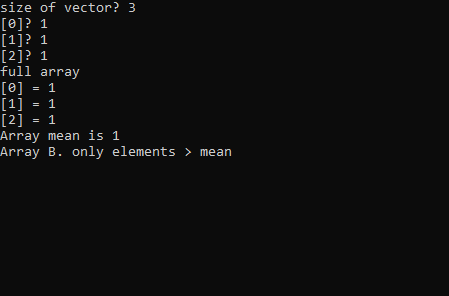
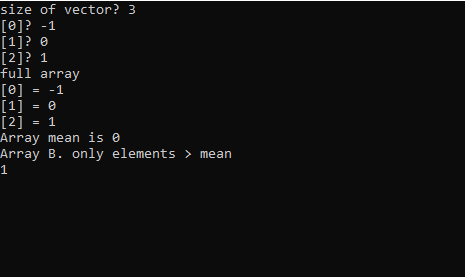

# HSE_FCS_SE-ASM

## Казанцев Никита БПИ191
Разработать программу, которая вводит одномерный массив A[N], формирует из элементов массива A новый массив B по правилам, указанным в таблице, и выводит его. Память под массивы может выделяться как статически, так и динамически по выбору разработчика.

Разбить решение задачи на функции следующим образом:

Ввод и вывод массивов оформить как подпрограммы.
Выполнение задания по варианту оформить как процедуру
Организовать вывод как исходного, так и сформированного массивов
Указанные процедуры могут использовать данные напрямую (имитация процедур без параметров). Имитация работы с параметрами также допустима.

Массив B из...значений которые больше среднего арифметического

## Программа
Отработка программы на нормальном вводе
- **Результат работы** 
  
  
  
  
 

Отработка программы на некорректном/ нестандартном вводе
- **Результат работы** 
  нулевая длина массива
   
  Когда нет элементов, больших среднего значения
   
  Работа с отрицательными числами
   

  

## Использованная литература/ интернет источники
1. Tomasz Grysztar. Flat Assembler Programmer’s Manual [Электронный
ресурс]. – Официальный сайт FASM. Режим доступа:
http://flatassembler.net/docs.php?article=manual

2. Vitali Kremez. FASM: Flat Assembler, also known as "FASM": Sample Code. [Электронный
ресурс] Режим доступа: https://vk-intel.org/2017/04/03/fasm-flat-assembler-also-known-as-fasm-sample-code/
