# HSE_FCS_SE-ASM

## Казанцев Никита БПИ191
весь код можно найти в папке DZ/[номер задачи]

## Программа 1
стандартная первая программа любого программиста. вывод Hello world в виде окна на экран
- **Код программы** 
  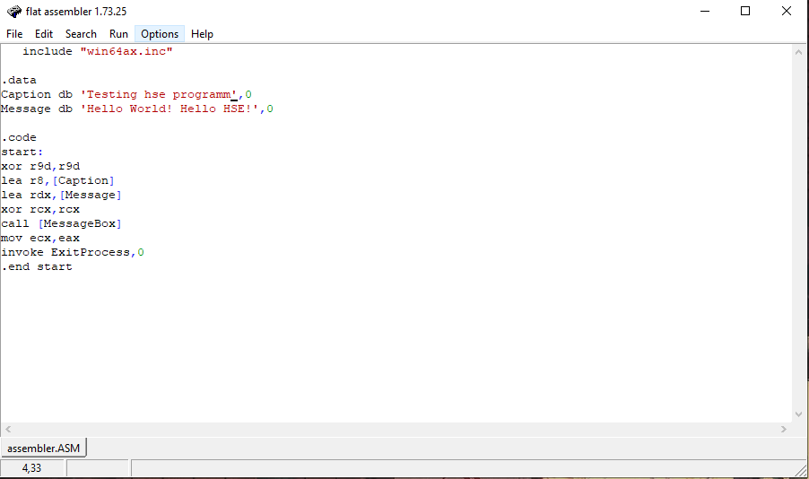 
- **Результат работы** 
  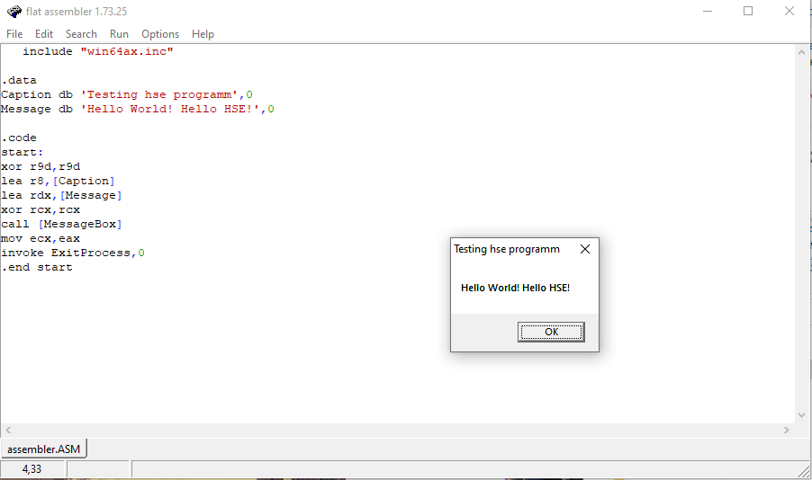 
  
## Программа 2
Потренировался с выводом в окне в зависимости от выбранной опции (нажатой кнопки)
В зависимости от выбора - счастлив ли ты сегодня - выводятся либо слова поддержки, либо счастливая реплика
- **Код программы** 
  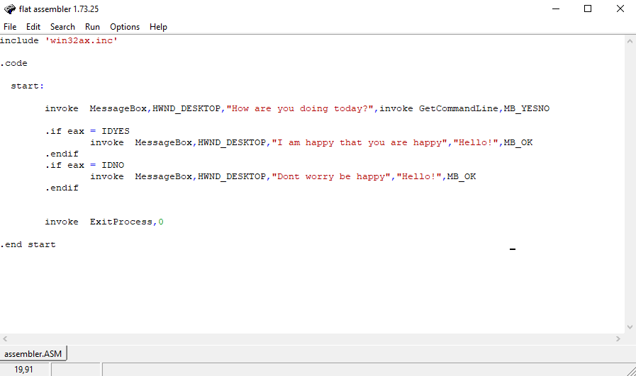 
- **Результат работы** 
  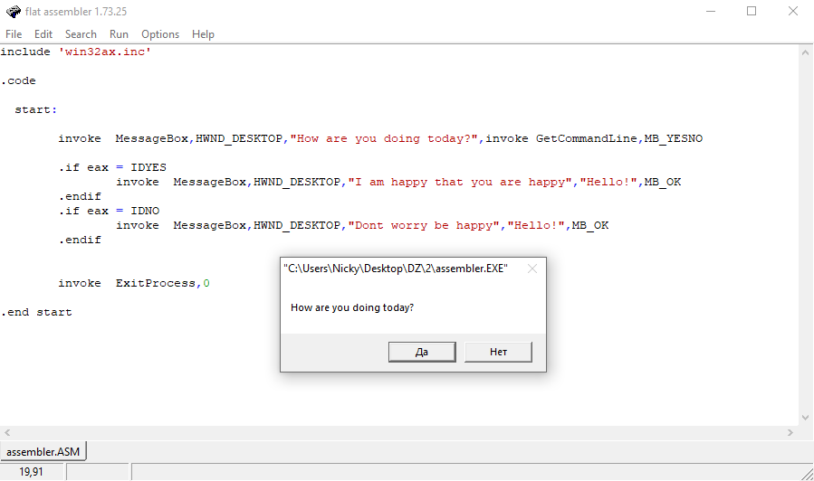 
  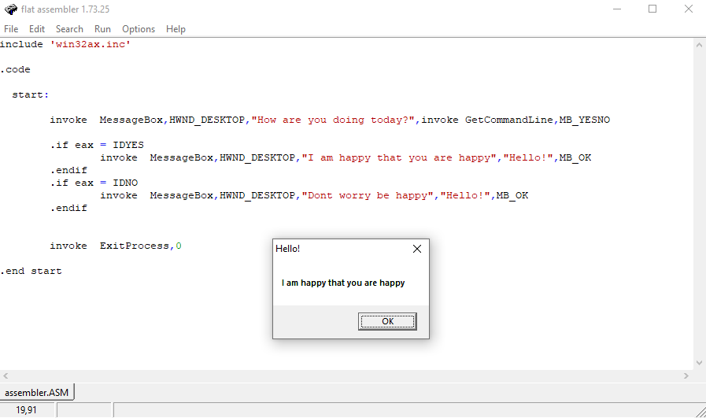 
  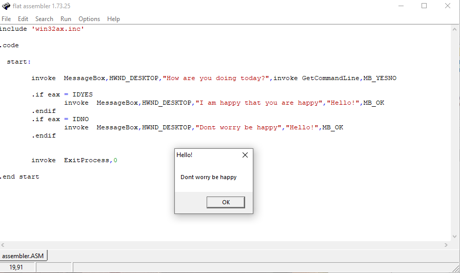 
## Программа 3
Попробовал создавать файлы в директории + писать внутри txt файла
- **Код программы** 
  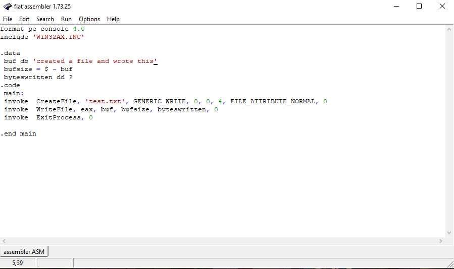 
- **Результат работы** 
  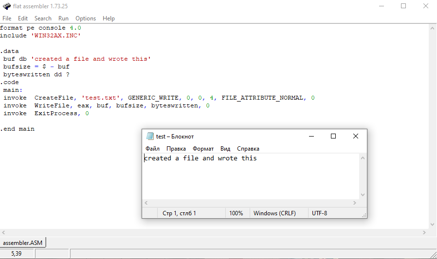 
  
## Программа 4
Попробовал считывать текст из текстового файла и выводить на экран
- **Код программы** 
  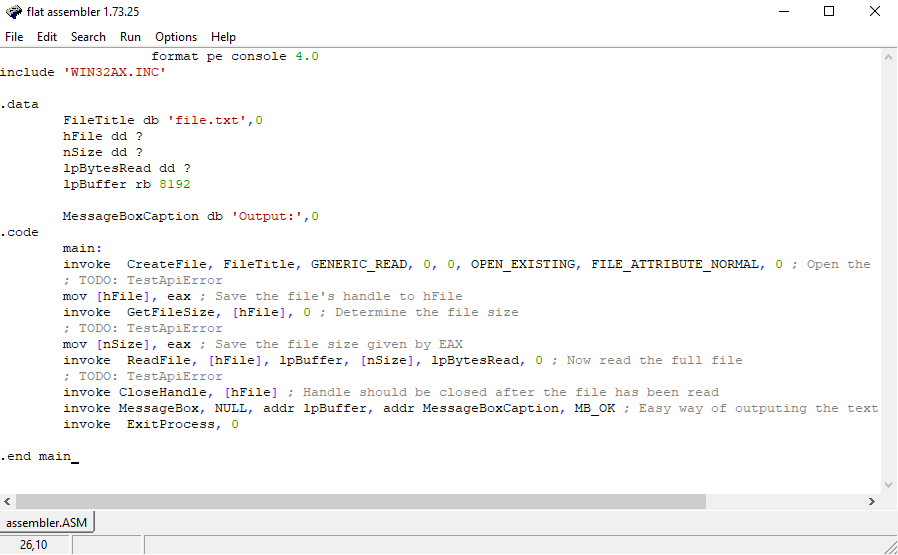 
- **Результат работы** 
  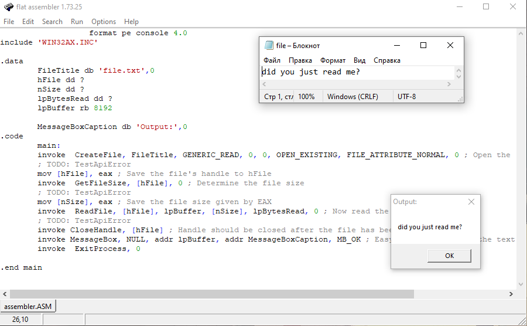 
  
## Программа 5
Попробовал копировать файл и вставлять его в др директорию
- **Код программы** 
  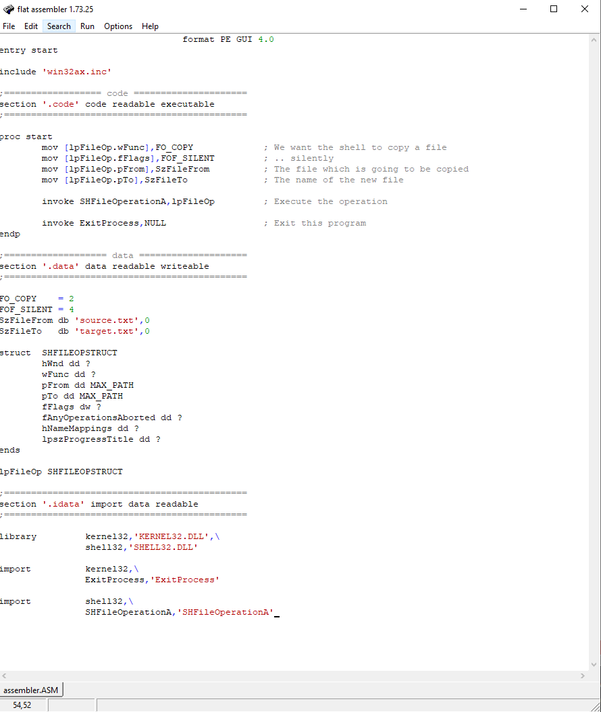 
- **Результат работы** 
  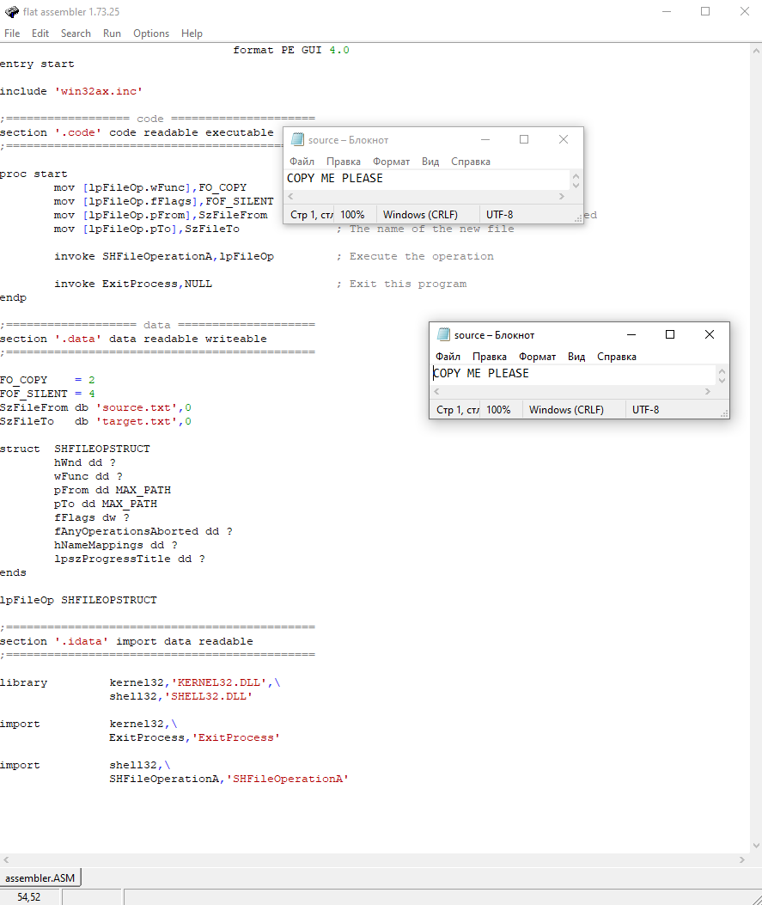 

